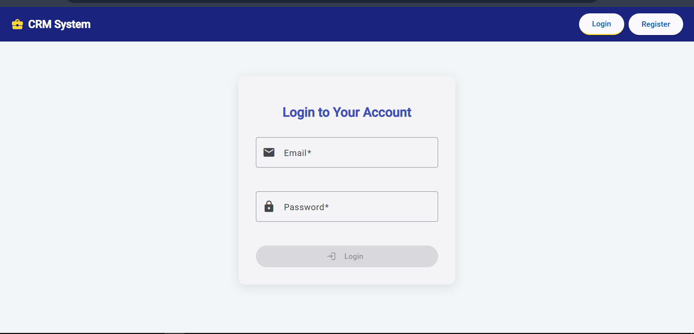
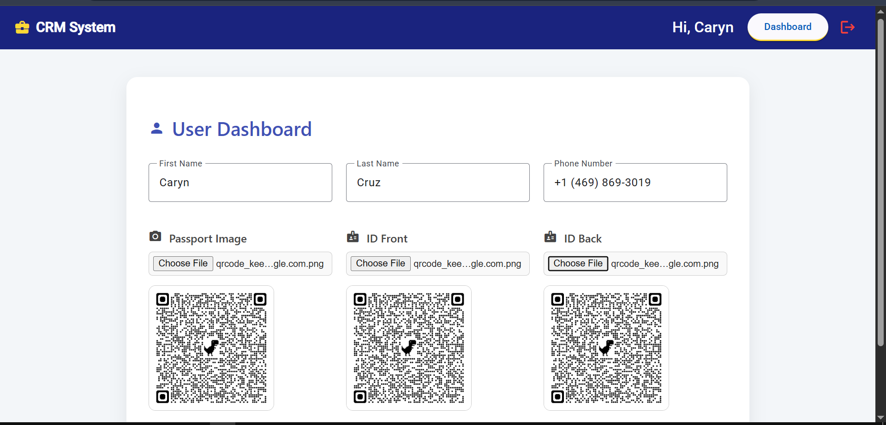
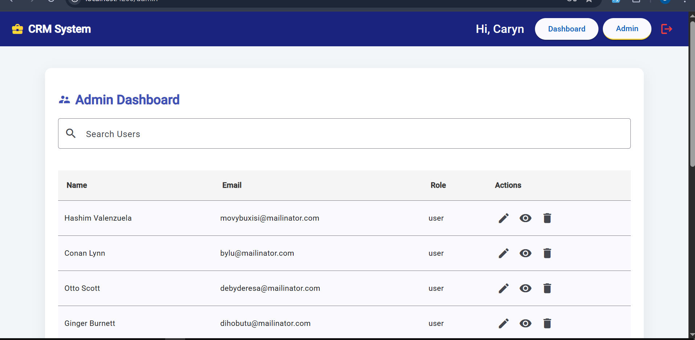
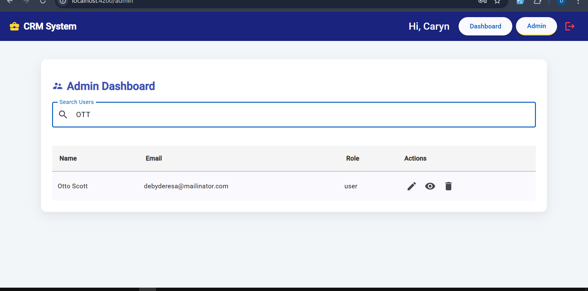
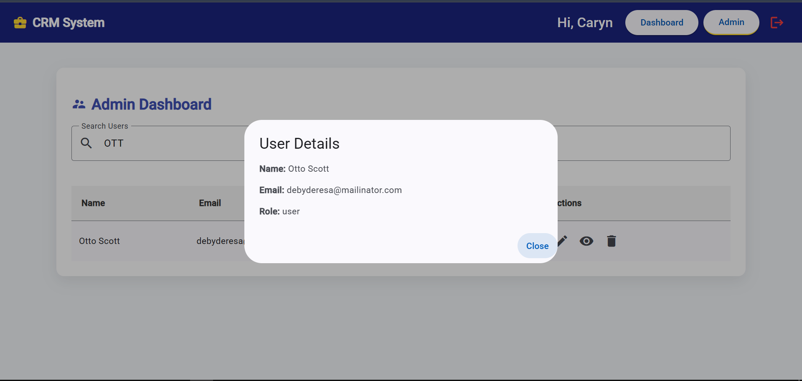
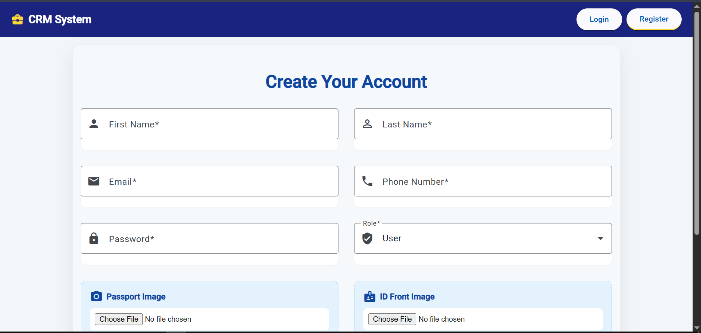

# 🧩 CRM Management System

A lightweight yet extensible **CRM (Customer Relationship Management)** system designed for **company-wide employee management**. It supports **user registration**, **role-based administration**, and **real-time user management features**. Built using **Angular** for the frontend and **Express.js** for the backend, the system provides a flexible foundation that can be easily integrated with external modules such as payroll, analytics, support systems, and more.

---

## 🚀 Features

### 👥 User Features
- User registration
- Secure login/logout
- Personalized dashboard access
- Profile view and basic info update

### 🔐 Admin Features
- Full user management (view, edit, delete)
- Grant/revoke user permissions
- Search/filter users by name, role, or email
- Admin dashboard with statistics

### ⚙️ System Features
- RESTful API using Express.js
- Component-based UI using Angular
- Modular architecture ready for extensions
- Authentication (JWT or session-based)

---

## 🧰 Tech Stack

| Layer        | Technology       |
|--------------|------------------|
| Frontend     | Angular           |
| Backend      | Express.js (Node.js) |
| Auth         | JSON Web Token (JWT)  |
| Styling      |  Angular Material |
| API Format   | RESTful JSON      |

---

## 📸 Screenshots

1. **Login Page**  
   

2. **User Dashboard**  
   

3. **Admin Dashboard**  
   

4. **Admin: Search Users**  
   

5. **Admin: View User Details**  
   

6. **Admin: Edit User**  
   

7. **Registration Page**  
   

---

## 🛠️ Setup Instructions

### Prerequisites
- Node.js (v16+)
- Angular CLI (`npm install -g @angular/cli`)
- MongoDB (or another preferred database)

### Backend Setup (Express)
```bash
cd backend
npm install
npm start
```

### Frontend Setup (Angular)
```bash
cd frontend
npm install
ng serve
```

> Make sure to update the `API_URL` in your Angular environment file to match your backend.

---

## 🔌 Integration Ideas
- Employee attendance tracking
- Payroll system integration
- Role-based analytics dashboard
- External authentication providers (Google, GitHub)
- Notification system (email/SMS)

---

## 📂 Project Structure

```
/frontend       -> Angular app
/backend        -> Express REST API
/README.md      -> Project documentation
```

---

## 📜 License

This project is licensed under the **MIT License**.

---

## 🙋‍♂️ Author

Built by [Clifford Mukosh](mailto:cliffordmukosh@gmail.com) — Full Stack Software Engineer.
